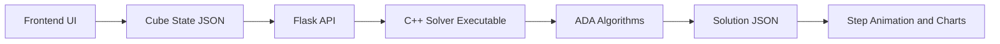
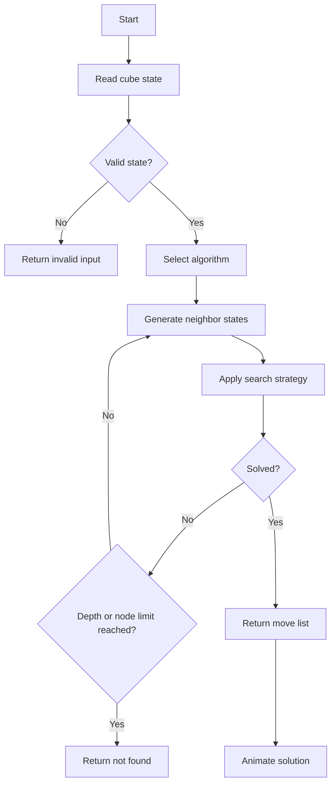

# Rubik's Cube Solver Website

An ADA (Analysis and Design of Algorithms) mini project that demonstrates a modern Rubik's Cube solver website with a C++ algorithm backend, Flask bridge, 3D cube visualization, color input, step-by-step animation, algorithm comparison, complexity analysis, and viva-ready documentation.

## Introduction

The Rubik's Cube can be viewed as a huge graph. Each cube arrangement is a node, and each rotation is an edge that connects one state to another. This project uses that idea to demonstrate graph traversal, searching, backtracking, pruning, greedy choice, heuristic evaluation, and A* search.

The frontend is built with HTML, CSS, and JavaScript. The backend is built with Flask and a C++ solver executable. Flask receives the cube state from the browser, runs the C++ solver, and returns solution steps as JSON.

## Objective

- Build a professional interactive Rubik's Cube solver website.
- Use C++ as the main algorithm implementation language.
- Demonstrate ADA concepts using BFS, DFS, backtracking, branch and bound, greedy, heuristic search, IDDFS, and A*.
- Show move count, time taken, nodes explored, complexity, algorithm comparison, and step-by-step solving animation.
- Provide documentation suitable for engineering mini project presentation and viva.

## Features

- Dark modern responsive UI.
- CSS 3D Rubik's Cube visualization.
- 2D color input system for all 54 stickers.
- Cube state validation and invalid input detection.
- Buttons for Shuffle Cube, Solve Cube, Reset Cube, and Generate Random Cube.
- C++ backend solver with modular ADA algorithm files.
- Step-by-step solving animation.
- Move history and solution step output.
- Algorithm comparison chart.
- Time and space complexity tables.
- Project architecture and flowchart.
- VS Code tasks for building and running.
- Ready-to-zip project structure.

## Technologies Used

| Layer | Technology |
|---|---|
| Frontend | HTML, CSS, JavaScript |
| Backend bridge | Python Flask |
| Algorithm engine | C++17 |
| Compiler | MinGW-w64 / g++ |
| Editor | Visual Studio Code |
| Data format | JSON |

## Algorithms Used

| Algorithm | Purpose in Project |
|---|---|
| BFS | Explores cube states level by level to find shortest paths within a depth limit. |
| DFS | Traverses deeply using stack-based graph exploration. |
| Backtracking | Recursively tries moves and undoes invalid paths. |
| Branch and Bound | Prunes branches whose estimated cost cannot improve the current best solution. |
| Greedy Method | Chooses the locally best rotation using misplaced sticker score. |
| Heuristic Search | Uses heuristic priority to explore promising states first. |
| IDDFS | Combines DFS memory efficiency with BFS-style depth completeness. |
| A* | Uses `f(n) = g(n) + h(n)` for guided search. |

## Data Structures Used

| Data Structure | Usage |
|---|---|
| Queue | BFS frontier. |
| Stack | DFS frontier. |
| Hash Map | A* best-depth tracking and JSON style lookup logic. |
| Set / Hash Set | Visited states and active recursion path. |
| Arrays | 54 sticker cube representation and face centers. |
| Graph | Cube state-space graph. |
| Tree | Search tree generated from possible rotations. |
| Priority Queue | A* and heuristic best-first search. |

## System Architecture



## Solver Flowchart



## Folder Structure

```text
RubiksCubeSolver/
|
|-- frontend/
|   |-- index.html
|   |-- style.css
|   |-- script.js
|
|-- backend/
|   |-- solver.cpp
|   |-- cube.hpp
|   |-- server.py
|   |-- algorithms/
|       |-- solver_algorithms.hpp
|       |-- bfs.cpp
|       |-- dfs.cpp
|       |-- astar.cpp
|       |-- backtracking.cpp
|       |-- branch_bound.cpp
|       |-- greedy.cpp
|       |-- heuristic.cpp
|       |-- iddfs.cpp
|
|-- docs/
|   |-- PROJECT_REPORT.md
|
|-- .vscode/
|   |-- tasks.json
|
|-- README.md
|-- requirements.txt
```

## Installation Steps

### 1. Install VS Code

1. Go to `https://code.visualstudio.com/`.
2. Download Visual Studio Code for Windows.
3. Install it with default options.
4. Open VS Code.

### 2. Required VS Code Extensions

Install these extensions from the VS Code Extensions tab:

- C/C++ by Microsoft
- Python by Microsoft
- Code Runner, optional
- Live Server, optional

### 3. Install C++ Compiler and MinGW

Recommended option: install MSYS2 / MinGW-w64.

1. Download MSYS2 from `https://www.msys2.org/`.
2. Install MSYS2.
3. Open the MSYS2 terminal and run:

```bash
pacman -Syu
pacman -S mingw-w64-ucrt-x86_64-gcc
```

4. Add this folder to Windows PATH:

```text
C:\msys64\ucrt64\bin
```

Alternative if you already have MinGW:

```text
C:\MinGW\bin
```

5. Verify installation:

```bash
g++ --version
```

### 4. Install Python

1. Download Python from `https://www.python.org/downloads/`.
2. During installation, enable "Add Python to PATH".
3. Verify:

```bash
python --version
pip --version
```

### 5. Install Node.js

This project does not require Node.js to run because Flask serves the frontend. Install it only if your college setup asks for it or if you want extra frontend tooling.

1. Download Node.js LTS from `https://nodejs.org/`.
2. Install with default options.
3. Verify:

```bash
node --version
npm --version
```

## VS Code Setup

1. Extract the project ZIP.
2. Open VS Code.
3. Click File > Open Folder.
4. Select the `RubiksCubeSolver` folder.
5. Open a terminal in VS Code with:

```text
Terminal > New Terminal
```

The project includes `.vscode/tasks.json` with:

- `Build C++ Solver`
- `Run Flask Backend`

You can run tasks from:

```text
Terminal > Run Task
```

## How to Run Project

Open a terminal inside the `RubiksCubeSolver` folder.

### 1. Create Python virtual environment

```bash
python -m venv .venv
```

Activate it on Windows PowerShell:

```bash
.\.venv\Scripts\Activate.ps1
```

If PowerShell blocks activation, run:

```bash
Set-ExecutionPolicy -Scope CurrentUser RemoteSigned
```

Then activate again:

```bash
.\.venv\Scripts\Activate.ps1
```

### 2. Install Python requirements

```bash
pip install -r requirements.txt
```
after this >>
python backend/server.py
### 3. Build C++ solver manually, optional

The Flask backend can compile automatically. Manual build command:

```bash
g++ -std=c++17 -O2 -Wall -Wextra backend/solver.cpp backend/algorithms/bfs.cpp backend/algorithms/dfs.cpp backend/algorithms/astar.cpp backend/algorithms/backtracking.cpp backend/algorithms/branch_bound.cpp backend/algorithms/greedy.cpp backend/algorithms/heuristic.cpp backend/algorithms/iddfs.cpp -o backend/solver.exe
```

### 4. Run backend and frontend

```bash
python backend/server.py
```

Open this URL in the browser:

```text
http://127.0.0.1:5000
```

## How Frontend and Backend Connect

1. JavaScript reads the 54-sticker cube state from the UI.
2. JavaScript sends a POST request to:

```text
/api/solve
```

3. Flask receives JSON data.
4. Flask compiles `solver.cpp` if needed.
5. Flask runs the C++ executable using `subprocess`.
6. C++ validates the cube, runs the selected algorithm, and prints JSON.
7. Flask returns JSON to the browser.
8. JavaScript displays move count, time, nodes, complexity, chart data, and step animation.

## API Test Commands

Health check:

```bash
curl http://127.0.0.1:5000/api/health
```

Compile endpoint:

```bash
curl -X POST http://127.0.0.1:5000/api/compile
```

Solve solved cube:

```bash
curl -X POST http://127.0.0.1:5000/api/solve -H "Content-Type: application/json" -d "{\"state\":\"WWWWWWWWWRRRRRRRRRGGGGGGGGGYYYYYYYYYOOOOOOOOOBBBBBBBBB\",\"algorithm\":\"astar\",\"history\":[],\"maxDepth\":7}"
```

## How to Test Project

1. Start backend with `python backend/server.py`.
2. Open `http://127.0.0.1:5000`.
3. Click `Shuffle Cube`.
4. Select an algorithm such as A*, IDDFS, or BFS.
5. Click `Solve Cube`.
6. Verify:
   - Cube animates step by step.
   - Move counter updates.
   - Time taken updates.
   - Algorithm used is displayed.
   - Nodes expanded are displayed.
   - Solution steps appear.
   - Comparison chart updates.
7. Try manual color editing.
8. Click `Validate` to check invalid color counts.

## Complexity Analysis

Let:

- `b` = branching factor, up to 18 possible moves.
- `d` = solution depth.
- `m` = maximum search depth.

### Time Complexity

| Algorithm | Time Complexity | Explanation |
|---|---|---|
| BFS | `O(b^d)` | Explores all states level by level until depth `d`. |
| DFS | `O(b^m)` | Can explore a deep search tree up to maximum depth `m`. |
| Backtracking | `O(b^d)` with pruning | Prunes repeated or invalid paths. |
| Branch and Bound | `O(b^d)` worst case | Bound reduces practical search. |
| Greedy | `O(bd)` | Checks all immediate moves at each depth. |
| Heuristic Search | `O(b^d)` | Depends on heuristic quality. |
| IDDFS | `O(b^d)` | Repeats DFS with increasing limits. |
| A* | `O(b^d)` worst case | Faster when heuristic is informative. |

### Space Complexity

| Algorithm | Space Complexity | Explanation |
|---|---|---|
| BFS | `O(b^d)` | Stores frontier and visited states. |
| DFS | `O(bm)` | Stores stack/path up to depth. |
| Backtracking | `O(d)` | Stores recursion path. |
| Branch and Bound | `O(d)` | Stores recursion path and best bound. |
| Greedy | `O(d)` | Stores chosen path. |
| Heuristic Search | `O(b^d)` | Stores priority queue and visited states. |
| IDDFS | `O(d)` | Uses depth-limited DFS memory. |
| A* | `O(b^d)` | Stores open set and best-depth map. |

## ADA Concepts Explanation

- State-space search: Every cube state is modeled as a graph node.
- Graph traversal: BFS and DFS traverse possible rotations.
- Backtracking: A recursive path is built and undone when it fails.
- Optimization: Branch and bound removes paths that cannot improve the answer.
- Greedy method: A local best move is selected based on sticker mismatch score.
- Heuristic method: Estimated distance guides search priority.
- A* search: Combines actual cost `g(n)` and heuristic cost `h(n)`.
- Iterative deepening: Searches depth 0, then 1, then 2, and so on.

## Screenshots Section

Add screenshots after running the project:

```text
docs/screenshots/home.png
docs/screenshots/verified-home.png
docs/screenshots/color-input.png
docs/screenshots/solving-animation.png
docs/screenshots/algorithm-comparison.png
```

Suggested screenshots:

- Landing page with 3D cube.
- Color input system.
- Solving animation.
- Algorithm comparison chart.
- Complexity table.

## Future Enhancements

- Add full physical cubie parity validation.
- Integrate Kociemba two-phase solving for arbitrary real cube inputs.
- Add camera-based sticker detection.
- Add downloadable PDF project report.
- Add user accounts and saved solve history.
- Add voice narration for solving steps.
- Add real-time 3D drag rotation controls.

## Conclusion

This project demonstrates how a Rubik's Cube can be modeled as a graph problem and solved using important ADA techniques. The website provides an interactive frontend, while the C++ backend implements core algorithms and returns measurable results. It is suitable for mini project demonstration, algorithm explanation, and viva preparation.

## Viva Questions and Answers

### 1. What is the main objective of this project?

To demonstrate ADA algorithms by modeling Rubik's Cube solving as a graph search problem and building an interactive website around it.

### 2. Why is the Rubik's Cube considered a graph problem?

Each cube state is a node, and each rotation is an edge from one state to another.

### 3. Which language is used for algorithms?

C++17 is used for the algorithm engine.

### 4. What is BFS used for?

BFS explores states level by level and finds the shortest solution within the depth limit.

### 5. What is DFS used for?

DFS explores one branch deeply before trying another branch, using less memory than BFS.

### 6. What is backtracking?

Backtracking tries a move, continues recursively, and undoes the move if the path fails.

### 7. What is branch and bound?

It is an optimization method that removes branches whose estimated cost is worse than the best known answer.

### 8. Why can greedy search fail?

Because a locally best move may lead to a state that blocks global progress.

### 9. What is a heuristic?

A heuristic is an estimate used to judge how close a state is to the goal.

### 10. How does A* work?

A* uses `f(n) = g(n) + h(n)`, where `g(n)` is actual path cost and `h(n)` is estimated cost to goal.

### 11. What is IDDFS?

IDDFS runs DFS repeatedly with depth limits 0, 1, 2, and so on.

### 12. Why use Flask?

Flask connects the browser frontend with the C++ executable using a simple API.

### 13. What data structure does BFS use?

BFS uses a queue.

### 14. What data structure does DFS use?

DFS uses a stack.

### 15. What data structure does A* use?

A* uses a priority queue.

### 16. How is invalid input detected?

The solver checks that there are 54 stickers, six valid colors, exactly 9 stickers per color, and fixed center stickers.

### 17. Why is a hash set used?

It stores visited cube states to avoid cycles and repeated exploration.

### 18. What is the branching factor?

The project uses up to 18 moves: six faces with clockwise, anticlockwise, and double rotations.

### 19. What is the output of the backend?

The backend returns JSON containing validation result, solved status, move list, move count, time, nodes expanded, complexity, and comparison data.

### 20. What is a real-world use of these algorithms?

They are used in robotics, navigation, scheduling, game AI, route planning, and optimization systems.

## References

- Thomas H. Cormen, Charles E. Leiserson, Ronald L. Rivest, Clifford Stein, Introduction to Algorithms.
- Stuart Russell and Peter Norvig, Artificial Intelligence: A Modern Approach.
- Singmaster Rubik's Cube notation.
- Flask documentation: `https://flask.palletsprojects.com/`
- Visual Studio Code: `https://code.visualstudio.com/`
- MSYS2: `https://www.msys2.org/`
