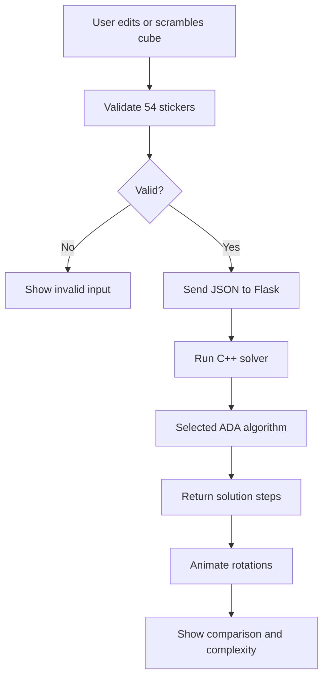

# ADA Mini Project Report: Rubik's Cube Solver Website

## Abstract

This project presents a Rubik's Cube Solver Website that demonstrates core ADA concepts through a visual and interactive application. The cube is modeled as a state-space graph where every cube state is a node and every legal rotation is an edge. The project uses C++ for algorithm implementation and a Flask API to connect the C++ solver with a modern HTML, CSS, and JavaScript frontend.

## Problem Statement

Design and implement a Rubik's Cube solver website that accepts a cube state, validates it, applies ADA algorithms, returns solution steps, and animates the solution in a 3D cube visualization.

## Modules

| Module | Description |
|---|---|
| Frontend UI | 3D cube, color input, buttons, charts, documentation sections. |
| Flask Server | Receives JSON requests and executes the C++ solver. |
| C++ Cube Engine | Represents cube states and applies rotations. |
| Algorithm Modules | BFS, DFS, A*, IDDFS, backtracking, branch and bound, greedy, heuristic search. |
| Result Renderer | Displays moves, time, nodes, complexity, and animation. |

## Algorithm Mapping

| ADA Topic | Project Implementation |
|---|---|
| Graph traversal | BFS and DFS over cube states. |
| Backtracking | Recursive search with undo operation. |
| Optimization | Branch and bound pruning. |
| Greedy method | Lowest misplaced-sticker move selection. |
| Heuristic search | Priority based on estimated distance. |
| A* | `g(n) + h(n)` priority queue. |
| Iterative deepening | DFS repeated with increasing depth. |

## Data Structures

- Queue for BFS.
- Stack for DFS.
- Hash set for visited states.
- Hash map for A* best depth.
- Priority queue for A* and heuristic search.
- Arrays and strings for the 54-sticker cube.
- Recursive tree for backtracking and IDDFS.

## Flowchart

## Complexity Summary

| Algorithm | Time | Space |
|---|---|---|
| BFS | `O(b^d)` | `O(b^d)` |
| DFS | `O(b^m)` | `O(bm)` |
| Backtracking | `O(b^d)` with pruning | `O(d)` |
| Branch and Bound | `O(b^d)` worst case | `O(d)` |
| Greedy | `O(bd)` | `O(d)` |
| Heuristic Search | `O(b^d)` | `O(b^d)` |
| IDDFS | `O(b^d)` | `O(d)` |
| A* | `O(b^d)` | `O(b^d)` |

## Real-World Applications

- Robotics motion planning.
- Game AI search.
- Route planning.
- Logistics optimization.
- Puzzle solving.
- Network routing.
- Scheduling and decision support.

## Limitations

- Full arbitrary Rubik's Cube solving is a very large search problem.
- The project is designed for ADA demonstration and solves website-generated legal scrambles reliably.
- Manual cube states are searched within the selected depth and node limits.

## Conclusion

The project successfully combines frontend visualization with backend C++ algorithms. It demonstrates how ADA concepts can be applied to a real interactive problem and provides measurable outputs such as move count, execution time, node expansion, and complexity comparison.
